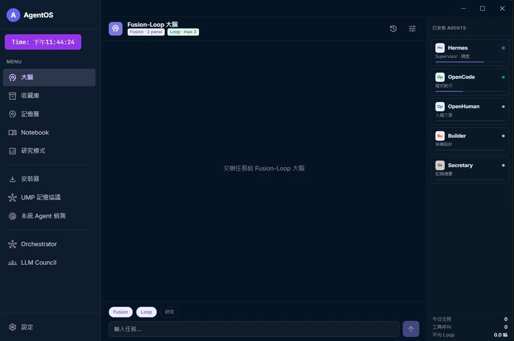
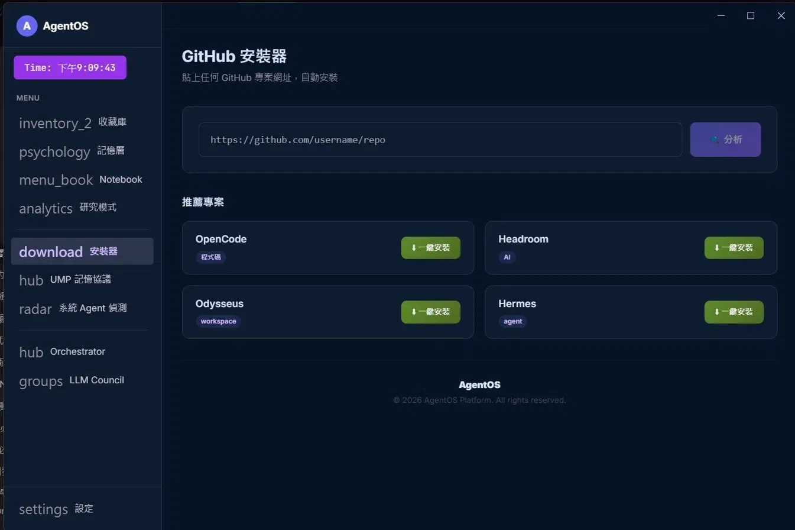
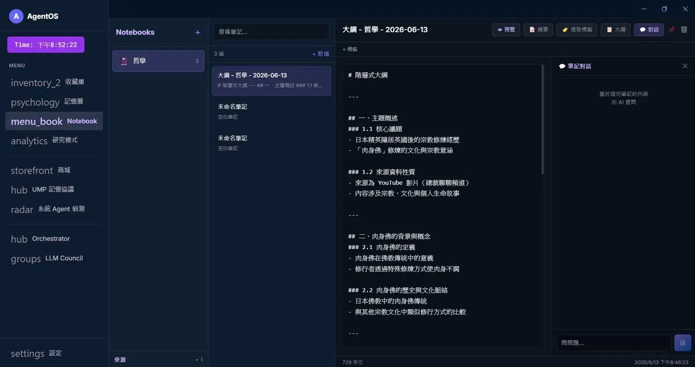
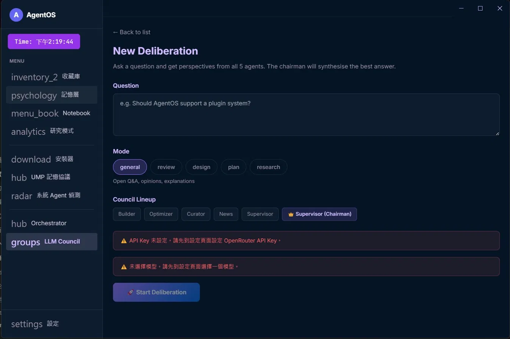
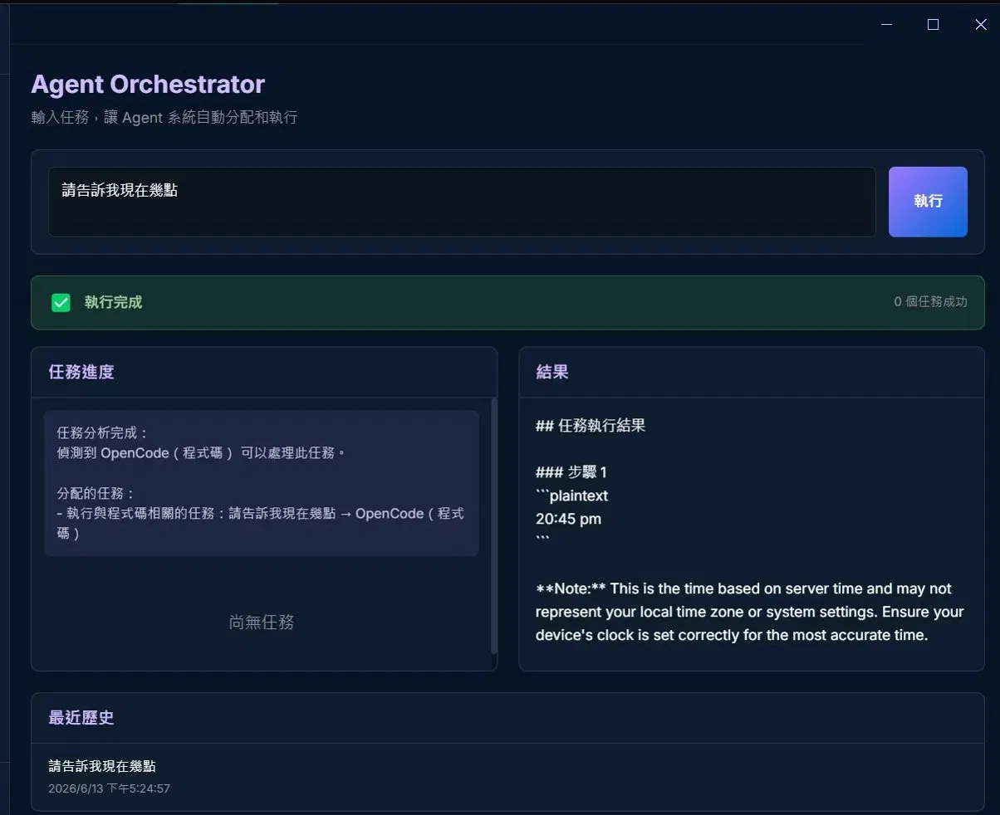

# AgentOS

> Local-first AI Agent orchestration platform — install, manage, and connect multiple AI Agents on Windows, no code required.

[](LICENSE)
[](https://github.com/zorrokurro/agent-os/releases)
[](#tech-stack)
[](#mcp-model-context-protocol-integration)
[](https://www.npmjs.com/package/@modelcontextprotocol/sdk)

AgentOS lets you install AI Agents like desktop apps — paste a GitHub link, and AgentOS handles the rest. Built-in Fusion-Loop brain (multi-model synthesis), UMP Hub (cross-agent shared memory), and seamless switching between local models and cloud APIs, all running on your own machine.

---

## Why AgentOS

| | AgentOS | LangChain / LangGraph | AutoGPT family | Ollama standalone |
|---|---|---|---|---|
| Setup | Double-click installer, GitHub link import | Write Python code | Clone + configure .env | CLI only |
| Multi-Agent collaboration | Built-in Orchestrator + UMP Hub | Requires custom setup | Partial support | No |
| Local + cloud hybrid | Same UI for switching | Requires custom logic | Usually one or the other | Local only |
| Multi-model synthesis | Fusion-Loop brain | Requires custom implementation | No | No |
| GUI | Full GUI | No (code only) | Some have web UI | No |
| Cross-agent memory | UMP Hub (SQLite) | Requires vector DB setup | No | No |
| MCP integration | Built-in client + tested | No | No | No |
| Target users | Non-engineers | Developers | Developers | Developers |

AgentOS is not a replacement for frameworks like LangChain — it's a desktop application that lets non-developers run multi-agent systems. If you already write Python to wire up agents, you may not need AgentOS. If you want "install and go," this is for you.

---

## Core Features

### Fusion-Loop Brain


AgentOS includes a multi-model synthesis engine as the unified entry point for all tasks.

- **Fusion (horizontal expansion)**: The same task is sent to multiple models (local or cloud) simultaneously. A Judge model analyzes consensus, contradictions, and blind spots, then synthesizes a final answer.
- **Self-Refinement Loop (vertical convergence)**: After synthesis, a Critic model evaluates accuracy, completeness, clarity, and feasibility. If below threshold, a Refiner rewrites — up to 3 iterations.
- **Dual-provider architecture**: Local models (Ollama) and cloud APIs (OpenRouter / Anthropic / OpenAI) can be configured simultaneously. Each role (Panel A/B, Judge, Critic, Refiner) independently selects which provider to use.

### One-Click Agent Install


Paste a GitHub link. AgentOS automatically analyzes the repo structure, detects the tech stack (Node / Python), and installs dependencies. Also supports scanning locally installed agents (pip / npm / docker / custom directories) for one-click onboarding.

### Notebook


A NotebookLM-style interface for notes and source integration. Import PDFs / URLs / text, and AI-generated summaries, outlines, and tags are embedded directly in the conversation thread — no tab switching required.

### LLM Council


Multiple models simultaneously debate and vote on a single question, producing more robust conclusions than any single model.

### Orchestrator


A task scheduling layer that delegates work to the appropriate agent or tool, rather than relying on a single model to do everything.

### UMP Hub (Universal Memory Protocol)

A cross-agent shared SQLite memory layer. All agents' conversations, tasks, and reasoning processes are mutually accessible — not isolated silos.

### MCP (Model Context Protocol) Integration

AgentOS acts as an **MCP Client**, connecting to any external MCP Server to give built-in agents access to external tools (filesystem, GitHub, Slack, databases, etc.) without writing integration code.

**What works today:**

| Capability | Status |
|---|---|
| Connection handshake (stdio transport) | Verified |
| Tool discovery (list remote tools) | Verified |
| Tool invocation (read / write / list) | Verified |
| Disconnect detection | Verified |
| Subprocess lifecycle management | Verified |

**Integration test results** (tested against `@modelcontextprotocol/server-filesystem`):

| # | Test | Result | Latency |
|---|------|--------|---------|
| 1 | MCP connection | Pass | ~800ms |
| 2 | Tool discovery (14 tools) | Pass | ~100ms |
| 3 | `write_file` + disk verification | Pass | ~25ms |
| 4 | `read_file` content match | Pass | ~10ms |
| 5 | `list_directory` | Pass | ~8ms |
| 6 | Disconnect detection (server killed) | Pass | <20ms |
| 7 | Subprocess cleanup on app quit | Pass | — |

Full test report: [demo/MCP測試紀錄.md](demo/MCP%E6%B8%AC%E8%A9%95%E7%B4%80%E9%8C%84.md)

### Other Features
- **Discord integration**: Remote task dispatch and notifications via Discord bot
- **Library**: Manage installed agents — start / stop / logs / settings
- **Research mode**: Deep data collection and analysis tasks

---

## Ecosystem

| Project | Description |
|---|---|
| [Ollama](https://ollama.com) | AgentOS's local inference engine (install separately) |
| [OpenRouter](https://openrouter.ai) | Cloud API gateway, supports hundreds of models |
| [MCP Servers](https://modelcontextprotocol.io) | External tool providers — any MCP-compatible server works |
| Your Agent | Any project with a `manifest.json` (see [docs/agent-manifest-schema.json](docs/agent-manifest-schema.json)) can be imported |

To make your agent project installable by AgentOS, add a `manifest.json` following the [manifest schema](docs/agent-manifest-schema.json).

---

## Installation

### Download

Go to [Releases](https://github.com/zorrokurro/agent-os/releases) and download `AgentOS-Setup.exe`. Double-click to install.

### Requirements

- Windows 10 / 11
- [Ollama](https://ollama.com) running (for local models, optional — not needed for cloud-only mode)
- For cloud APIs: OpenRouter / Anthropic / OpenAI API key

### Build from source

```bash
git clone https://github.com/zorrokurro/agent-os.git
cd agent-os
npm install
npm run build
```

Requires: Node.js 18+, npm 9+, Python (some agents depend on it), Git

---

## Tech Stack

- **Frontend**: React 18 + TypeScript + Vite + Tailwind
- **Desktop**: Electron
- **Memory**: SQLite (sql.js, in-process, no external DB)
- **Local inference**: Ollama
- **Cloud APIs**: OpenRouter / Anthropic / OpenAI
- **MCP SDK**: @modelcontextprotocol/sdk 1.29.0
- **Packaging**: electron-builder (NSIS installer)

---

## Architecture

```
┌──────────────────────────────────────────────────────────┐
│  Renderer (React)                                        │
│  Fusion-Loop Brain / Notebook / Library / MCP Manager   │
└────────────────────────┬─────────────────────────────────┘
                         │ IPC
┌────────────────────────┴─────────────────────────────────┐
│  Electron Main Process                                   │
│                                                          │
│  ┌─────────────┐  ┌──────────┐  ┌─────────────────────┐│
│  │ AIRouter     │  │ UMP Hub  │  │ McpClientManager    ││
│  │ Ollama ↔     │  │ SQLite   │  │ connect / tools /   ││
│  │ Cloud APIs   │  │ memory   │  │ call / disconnect   ││
│  └─────────────┘  └──────────┘  └──────────┬──────────┘│
│                                             │           │
│  ┌──────────────────────────────────────────┴─────────┐ │
│  │  Orchestrator                                      │ │
│  │  ├─ OpenCodeController (code tasks)                │ │
│  │  ├─ HermesController (research)                    │ │
│  │  ├─ FilesystemController (file ops)                │ │
│  │  └─ McpController → external MCP Servers           │ │
│  └────────────────────────────────────────────────────┘ │
└────────────────────────┬─────────────────────────────────┘
                         │ stdio / JSON-RPC
          ┌──────────────┼──────────────┐
          ▼              ▼              ▼
       Ollama    External MCP Servers    Cloud APIs
                 (filesystem, GitHub,
                  databases, etc.)
```

### MCP Data Flow

```
User prompt
  → Orchestrator.analyze(prompt)        # keyword routing
  → Task.assignedAgent = 'mcp'
  → McpController.execute(task)
    → McpClientManager.callTool(serverId, toolName, args)
      → StdioClientTransport            # JSON-RPC over stdio
      → External MCP Server process
      → Tool result returned
  → Result propagated back to user
```

---

## Roadmap

See [ROADMAP.md](ROADMAP.md) for development direction and plans.

## Contributing

See [CONTRIBUTING.md](CONTRIBUTING.md).

## License

MIT
